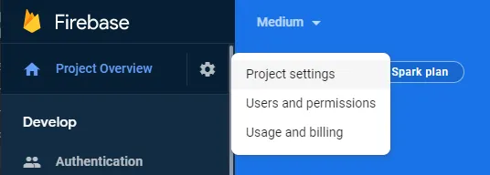
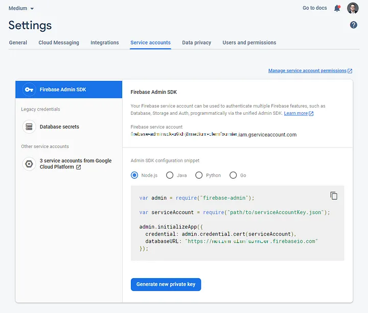

## Push notification using FCM (Firebase Cloud Messaging)

## Description
Send a push notification to user mobile, and web using FCM (Firebase Cloud Messaging).

### Installing via Composer

[Composer](http://getcomposer.org).

```bash
composer require heyharpreetsingh/fcm
```

Next, Register the service provider in file `bootstrap/providers.php` for L11 AND `config/app.php` in the `providers` key for l10

```bash
Heyharpreetsingh\FCM\Providers\FCMServiceProvider::class
```
Next, Generate new private key from your Firebase:

In order to get this file, let’s go to your Firebase projects page, then select your project and as shown below, go to `Project Settings`.



Click on the `Service accounts` tab, then Generate new private key.



A file named <your-project>-firebase-adminsdk-<first-numbers-of your-key>.json get generated, and it is your ServiceAccount.json file! Rename it (or change the path) and you’re ready to go.

⚠️ Your file can be generated only 1 time, if you create a new key, it will be a different one. Although, your previous key/file will still working until you decide to delete it (click on Manage service account permissions).

Next, Put your `ServiceAccount.json` file in your project storage directory and add the name of json file in your project `.env` file:

```bash
FCM_GOOGLE_APPLICATION_CREDENTIALS=path/to/serviceAccountKey.json
```

### Send a push notification on mobile(android, ios), and web.

use a `FCMFacade` to send a notification

```bash

use Heyharpreetsingh\FCM\Facades\FCMFacade;

FCMFacade::send([
   "message" => [
        "token":"bk3RNwTe3H0:CI2k_HHwgIpoDKCIZvvDMExUdFQ3P1...", //device token
        "notification": [
                "body":"This is an FCM notification message!",
                "title":"FCM Message"
        ]
    ]
]);

```

You can pass additional data using the official doc of FCM.

    - https://firebase.google.com/docs/reference/fcm/rest/v1/projects.messages/send
    - https://firebase.google.com/docs/reference/fcm/rest/v1/projects.messages#Message

If you have any issue or suggestion feel free to [contact](mailto:heyharpreetsingh@gmail.com "mail").

## License

Open-sourced software licensed under the [MIT license](https://opensource.org/licenses/MIT).
